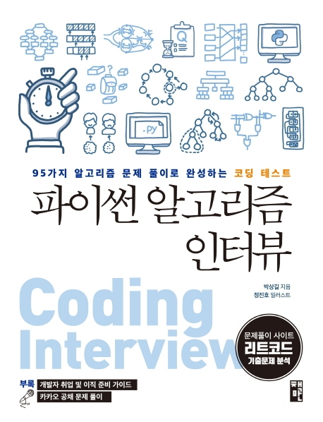

# Algorithm Test Practice (Python3)

# 하루에 한 문제라도 고민하는 습관을 들이자!

### 문제 풀이

- [백준](https://www.acmicpc.net/)

- [프로그래머스](https://programmers.co.kr/)

- [이코테(Youtube)](https://www.youtube.com/watch?v=m-9pAwq1o3w&list=PLRx0vPvlEmdAghTr5mXQxGpHjWqSz0dgC)

- [릿코드(from 파이썬 알고리즘 인터뷰)](https://leetcode.com/)

